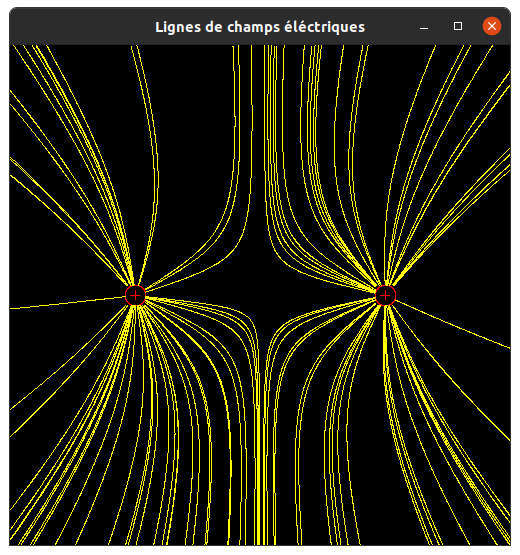

# Simulation des ligne de champs

## **Introduction**

Un champ éléctrique est le champ vectoriel créée par des particules éléctriquement chargées. Quand plusieurs charges sont à proximité de l'autres ces lignes de champs éléctriques diffère prenant en compte prenant en compte si la charges est chargée positivement ou négativement. La visualisation des lignes de champs éléctrique permet d'apercevoir directement ce qui se passe entre plusieurs charges qui pour nous la plupart du temps est invisible à l'oeil nu. Et que le comportement des lignes de champs éléctriques est différent dépendant du nombre de charges et du signe de chaque charge(positif ou négatif). De ce fait nous allons donc voir comment ai-je réaliser la visualisation de ces lignes de champs éléctriques, commençant tout d'abord par la réalisation des dessin de chaque charge. Puis la réalisation du dessin de chaque ligne de champ à partir d'un ensemble de particules dans notre univers. Puis comment j'ai assembler ces deux procédé pour avoir le tout sur l'écran(charges + lignes de champs éléctriques).

## **Réalisation du dessin des charges éléctriques**

Tout d'abord, chaque charge éléctrique sera représenté d'un cercle avec un plus ou moins à l'intérieur dépendant du signe de la charge:  


  
Pour représenter les droites du signe plus et moins à l'écran, j'ai utilisé l'algorithme de tracé de droites de Bresenham. Cela permet de tracer chaque pixel de la droite entre deux points pour que la droite soit plus précise sans saut incohérent de pixels comme ci-dessous: 


Pour le cercle autour de chaque charge, j'ai utilisé l'algorithme de tracé de cercle d'Andres. Cet algorithme permet de tracer des cercles en image matricielle, et donc de pouvoir dessiner un cercle sans laisser de trous. Le principe est de paver entièrement le plan par des cercles concentriques.

En assemblant ces deux différentes méthodes, j'ai pu dessiner le cercle autour de la charge avec un rayon donné puis dessiner le plus et le moins dépendant du signe de la charge. Le signe "plus" se dessine dans mon cas, en traçant une droite verticalement partant de la position de la charge plus ou moins le rayon de charge/2 :  
**Point 1**: x=pos(Charge).x+(rayon(Charge)/2) // y=pos(charge).y  
**Point 2**: x=pos(Charge).x-(rayon(Charge)/2) // y=pos(charge).y


Et de tracer également une droite horizontalement:  
**Point 1**: x=pos(Charge).x // y=pos(Charge).y+(rayon(Charge)/2)  
**Point 2**: x=pos(Charge).x // pos(Charge).y-(rayon(Charge)/2)

Pour le signe "moins", il suffit juste de reprendre le tracé horizontal.  

## **Réalisation de chaque ligne de champ**  

Chaque ligne de champ est dans notre cas calculé par rapport à une particule P positionné aléatoirement dans notre univers. Donc pour chaque P, on dessine une ligne de champ. Sachant que P est générer aléatoirement, P peut être positionné à l'intérieur d'une des charges(dans le rayon du cercle de la charge). Dans ce cas là, la ligne de champ pour ce P si ne sera pas dessiner. La ligne de champ sera également limité à la taille de notre fenêtre, donc quand notre ligne de champ excède cette limite on ne dessine plus.   
En prenant en compte cette limite, on peut maintenant dessiner notre ligne de champ. Pour cela, on commence tout d'abord par dessiner chaque pixel en commençant par notre P, en appliquant la formule suivante:  

$$P _\textit{suivant}=P+\delta \textit{x} \; \cdot \; \frac{\vec{E}}{\|\vec{E}\|}$$

On dessine également la ligne de champs dans le sens opposé, pour avoir la totalité de notre ligne de champs avec: 

$$P _\textit{suivant}=P-\delta \textit{x} \; \cdot \; \frac{\vec{E}}{\|\vec{E}\|}$$

Ici $\delta \textit{x} = \frac{1}{\sqrt{largeur^2+hauteur^2}}$ et $\vec{E}$ est le total de l'intensité du champs pour chaque charge dans notre univers:

$$\vec{E}=\sum_{i=0}^N E_\textit{i} \; \cdot \; \frac{\vec{q_\textit{i}P}}{\|\vec{q_\textit{i}P}\|}$$

$\vec{q_\textit{i}P}$ est la distance entre notre particule et chaque charge. Et $E_\textit{i}$, l’intensité de ce champs à une distance r de chaque particule:

$$E_\textit{i}=k\; \cdot \; \frac{Q}{r^2}$$

On a implémenter le calcul de ces lignes de champs en calculant chaque $P _\textit{suivant}$ à l'aide de la librairie de vecteur. Donc dans notre cas, les vecteurs sont calculées par rapport à la taille de notre univers qui est un rectangle de [0;1]×[0;1]:
```c
// Psuivant = P + tetaX * totalE / ||totalE||
vec2 P_next_calculate(vec2 previous_P, double tetaX, vec2 totalE)
{
  vec2 P_next;
  P_next = vec2_mul(tetaX, totalE);
  P_next = vec2_div(vec2_norm(totalE), P_next);
  P_next = vec2_add(previous_P, P_next);
  return P_next;
}
```
Le résultat de cette fonction nous donne donc une position dans notre univers. Mais pour le dessiner, il faut qu'on le convertisse en coordonnées. Donc pour cela on a utilisé la fonction donné, **position_to_coordinates(...)**:
```c
coordinates_t Pnext = position_to_coordinates(SCREEN_HEIGHT, SCREEN_WIDTH, 0
, LIMIT_X, 0, LIMIT_Y, P);
gfx_putpixel(ctxt, Pnext.column, Pnext.row, color);
```

On dessine donc la ligne de champ petit à petit en prenant en compte la limite de l'univers et en prenant en compte la distance avec chaque charge:

```c
// Returns false if pos0 is not a valid position
bool in_univers(vec2 p, double limitX, double limitY)
{
  // check if P is in the window
  return p.x <= limitX && p.y <= limitY && p.x >= 0.0 && p.y >= 0.0;
}

// (for example if pos0 is too close to a charge).
bool in_charge(vec2 p, charge_t *charges, int num_charges, double eps)
{
  // check if P is in the charges(pos(charges)-eps or pos(charges)+eps)
  // if it in the charge don't draw it
  for (int i = 0; i < num_charges; i++)
  {
    if (p.x > (charges[i].pos.x - eps) && p.x < (charges[i].pos.x + eps) &&
        p.y > (charges[i].pos.y - eps) && p.y < charges[i].pos.y + eps)
    {
      return true;
    }
  }
  return false;
}
```

La fonction **in_univers(...)** permet de verifier si on est toujours dans notre fenêtre donc on continue de dessiner. Et la fonction **in_charge(...)** permet de savoir si on est trop près de la charge dépendant du paramètre **eps**, qui est notre distance limite par rapport à la charge donc si cette fonction retourne vraie, on ne dessine plus la ligne de champs. Dans mon cas, j'ai pris comme limite le rayon du cercle de ma charge:

```c
//the radius of charge
#define CHARGE_RADIUS 10.0
```

## **Dessin de l'ensemble de l'univers** 

En assemblant les deux procédés précédant on obtient l'ensemble de nos charges et et le nombres de lignes de champs dépendant du nombre de particules générer aléatoirement dans notre univers. Les charges sont également placés aléatoirement avec la fonction suivante:

```c
//return a random position beetween 0 and 1
vec2 randomPos() { return (vec2){.x = rand_one(), .y = rand_one()}; }
```

Dans notre cas, la valeur de la charge donc le signe également sont générés aléatoirement.


## **Résultats**

Pour représenter les lignes de champs on a placer tout d'abord les charges de manière à représenter joliement les lignes de champs. Ci-dessous on a deux charges positives, on peut voir que les deux charges se repoussent entre eux:



Et quand on a une charge positive d'un côté et une charge négative de l'autre, on peut voir que les deux charges s'attirent entre elles:


On peut voir que pour représenter chaque charge dans notre univers, on a décider de représenter les charges positives en bleu, les charges négatives en bleu et les lignes de champs en jaune.

On a essayer plusieurs représentation pour bien modéliser les lignes de champs par exemple en mettant les charges de manières symétriques. Ce qui nous donne de belle figures comme ci-dessous:


## **Conclusion**

On a pu donc observer le comportement des lignes de champs dépendant du placement des charges et de leur signes. On sait également que lorsqu'on voudrait dessiner la ligne de champs trop près de la charge, la ligne de champs a cet endroit ne progresse plus et reste à proximité de la charge. Si le nombre de particules aléatoire diminue, le nombre de ligne de champ diminue et cela deviens plus dure d'apercevoir distinctement la forme des lignes de champs autour des charges. 
Pour améliorer mon travail, on pourrais déplacer les charges dynamiquement et modifier leur valeures et observer le changement au niveau des lignes champs. On pourrait également faire la même chose avec les particules pour avoir une animation au niveau des lignes de champs directement.
